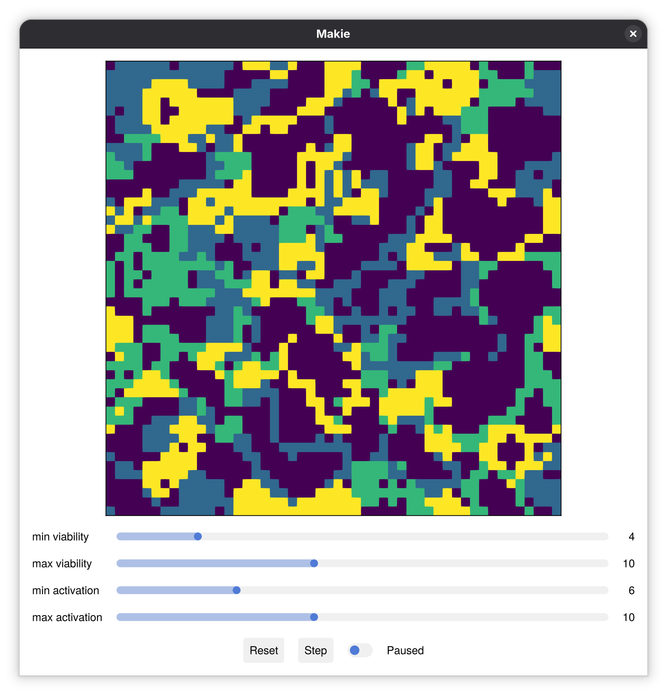
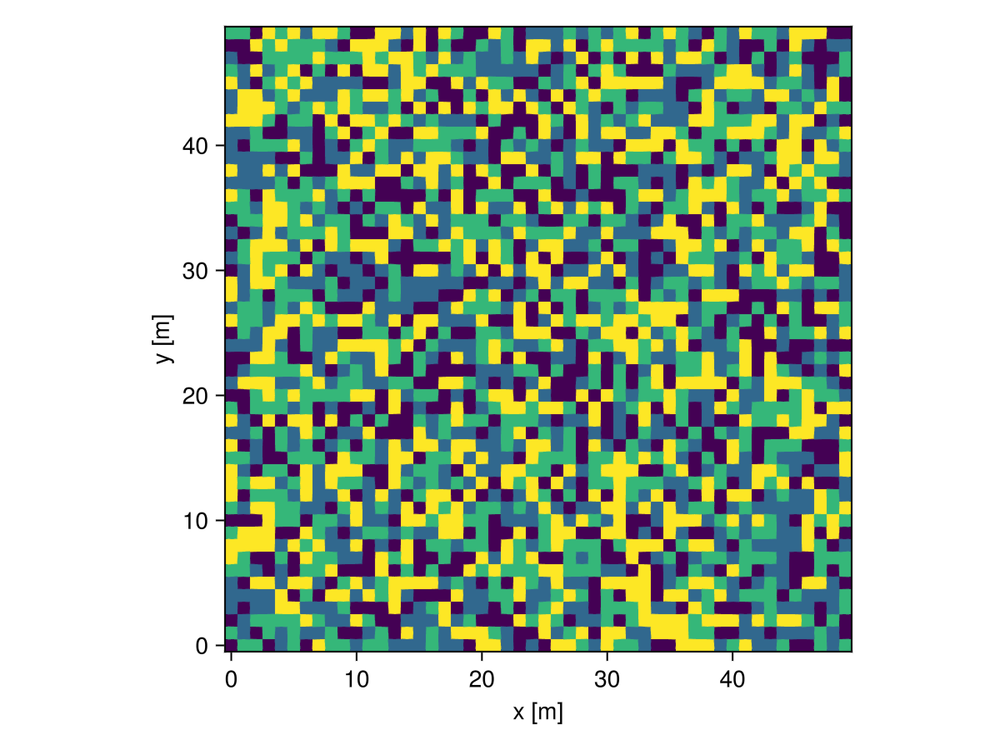
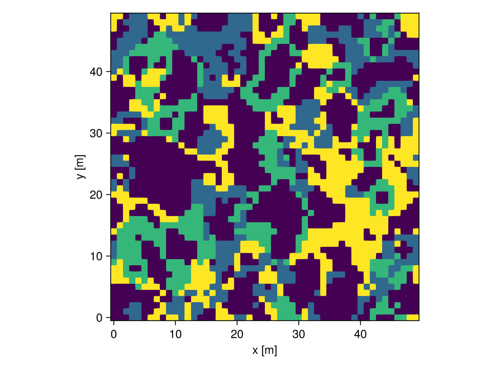
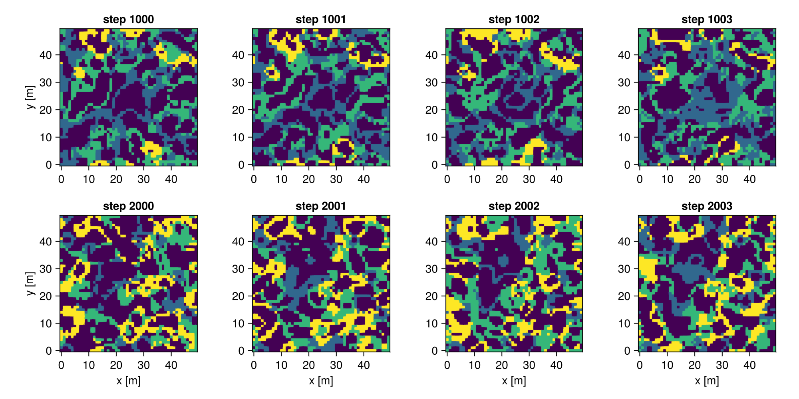

This widget lets you explore the dynamics of a particular cellular automaton that operates on a 5x5 stencil. We use this CA in the context of the carbonate platform modelling toolkit `CarboKitten.jl`.

## Howto run



 Clone this repository and run Julia with the following arguments:
 
```
julia --project=. -e 'using Pkg; Pkg.instantiate(); using CAExplorer; CAExplorer.main()'
```

## About

This model has a number of carbonate factories (also known as facies) compete for domination over a grid that represents an area of sea floor. For each facies you determine the rules under which its operates on the grid by specifying the **viability range** and the **activation range**.

The viability range sets the neighbour count under which a live cell will survive, while the activation range sets the neighbour count under which a dead cell may revive.

The CA operates more or less independently for each facies, except that each cell can host only a single facies at the same time.

## This demo

This demo runs the CA as it is implemented in CarboKitten and provides an interactive visualization using Makie.

<details><summary>The CAExplorer module</summary>

```julia
#| file: src/CAExplorer.jl
module CAExplorer
    using GLMakie
    using Observables
    using CarboKitten
    using CarboKitten.Components: CellularAutomaton as CA

    <<ca-explorer-methods>>

    function main()
        <<ca-explorer-main>>
    end

    function make_readme_figures()
        <<default-input>>
        <<plot-figures>>
    end
end
```

</details>

## Input

```julia
#| id: default-input
input = CA.Input(
    box = CarboKitten.Box{Periodic{2}}(
        grid_size=(50, 50), phys_scale=1.0u"m"
    ),
    facies = fill(CA.Facies(), 3)
)
```

The initial state is uniformly distributed random noise. We usually give the CA time to settle in its characteristic pattern before starting a CarboKitten run. Before this burn-in phase, the state looks as follows:



<details><summary>Plot code</summary>

```julia
#| id: plot-figures
let
    fig = Figure()
    x_axis, y_axis = box_axes(input.box)
    local_state = CA.initial_state(input)
    ax = Axis(fig[1, 1], aspect=DataAspect(), xlabel="x [m]", ylabel="y [m]")
    heatmap!(ax, x_axis |> in_units_of(u"m"), y_axis |> in_units_of(u"m"), local_state.ca)
    save("fig/noise.png", fig)
end
```

</details>

We define a helper function to burn-in (a term borrowed from MCMC) the CA.


```julia
#| id: ca-explorer-methods
function burn_in_state(input, state)
    step! = CA.step!(input)
    for _ in 1:100
        step!(state)
    end
    state
end
```

The following can be considered a typical quasi-static state for the default CA.



<details><summary>Plot code</summary>

```julia
#| id: plot-figures
let
    fig = Figure()
    x_axis, y_axis = box_axes(input.box)
      local_state = burn_in_state(input, CA.initial_state(input))
    ax = Axis(fig[1, 1], aspect=DataAspect(), xlabel="x [m]", ylabel="y [m]")
    heatmap!(ax, x_axis |> in_units_of(u"m"), y_axis |> in_units_of(u"m"), local_state.ca)
    save("fig/after-burn-in.png", fig)
end
```

</details>

## Longevity

An important property of the default settings of the CA is that on the short term there is some stability, and on the long term things can change a lot.



<details><summary>Plot code</summary>

```julia
#| id: plot-figures
let
    input = CA.Input(
        box = CarboKitten.Box{Periodic{2}}(
            grid_size=(50, 50), phys_scale=1.0u"m"),
        facies = fill(CA.Facies(), 3)
    )

    state = CA.initial_state(input)
    step! = CA.step!(input)

    for _ in 1:1000
        step!(state)
    end

    fig = Figure(size=(1000, 500))
    axes_indices = Iterators.flatten(eachrow(CartesianIndices((2, 4))))
    xaxis, yaxis = box_axes(input.box)
    i = 1000

    for row in 1:2
        for col in 1:4
            ax = Axis(fig[row, col], aspect=AxisAspect(1), title="step $(i)")

            if row == 2
                ax.xlabel = "x [m]"
            end
            if col == 1
                ax.ylabel = "y [m]"
            end

            heatmap!(ax, xaxis/u"m", yaxis/u"m", state.ca)
            step!(state)
            i += 1
        end
        for _ in 1:996
            step!(state)
            i += 1
        end
    end
    save("fig/ca-long-term.png", fig)
end
```

</details>

## The explorer

We need another helper function. This is responsible for animating the CA at the desired speed.

```julia
#| id: ca-explorer-methods
function tic(t, dt, running)
    @async begin
        while running[]
            sleep(dt)
            t[] += dt
        end
    end
end
```

The following code uses `Observables.jl`. This is a framework by which values are live updated as input values change, also known as *reactive functional programming*. We can transform an `Observable` into another one by calling `lift(observable) do value; ...; end`. The different visualization types available in Makie are `Observables` aware.

```julia
#| id: ca-explorer-main
@info "Welcome to CarboKitten's CAExplorer.jl!"

input = CA.Input(
    box = CarboKitten.Box{Periodic{2}}(
        grid_size=(50, 50), phys_scale=1.0u"m"),
    facies = fill(CA.Facies(), 3)
)
state = CA.initial_state(input)
image = Observable(state.ca)

fig = Figure(size=(800, 800))
ax = Axis(fig[1, 1], aspect=DataAspect(),
    xticksvisible=false, xticklabelsvisible=false,
    yticksvisible=false, yticklabelsvisible=false)

sg = SliderGrid(fig[2, 1],
        ( label = "min viability", range = 0:25, startvalue = 4 ),
        ( label = "max viability", range = 0:25, startvalue = 10 ),
        ( label = "min activation", range = 0:25, startvalue = 6 ),
        ( label = "max activation", range = 0:25, startvalue = 10 ))

t = Observable(0.0)
fig[3, 1] = button_grid = GridLayout(tellwidth = false)
reset_button = button_grid[1, 1] = Button(fig, label="Reset")
step_button = button_grid[1, 2] = Button(fig, label="Step")
running = button_grid[1, 3] = Toggle(fig, active=false)
button_grid[1, 4] = Label(fig, lift(x -> x ? "Playing" : "Paused", running.active))

on(running.active) do activated
    if activated
        tic(t, 0.01, running.active)
    end
end

step! = lift([s.value for s in sg.sliders]..., reset_button.clicks) do i, j, k, l, _
    facies = [
        CA.Facies((i, j), (k, l)),
        CA.Facies((i, j), (k, l)),
        CA.Facies((i, j), (k, l)),
    ]
    input = CA.Input(
        box = CarboKitten.Box{Periodic{2}}(
            grid_size=(50, 50), phys_scale=1.0u"m"),
        facies = facies
    )
    CA.step!(input)
end

onany(t, step_button.clicks) do _, _
    step
    image[] = state.ca
end

heatmap!(ax, image)
fig
```

## Authors

Lead engineer: __Johan Hidding__
The Netherlands eScience Center
email: j.hidding [at] esciencecenter.nl
Web page: [www.esciencecenter.nl/team/johan-hidding-msc/](https://www.esciencecenter.nl/team/johan-hidding-msc/)
ORCID: [0000-0002-7550-1796](https://orcid.org/0000-0002-7550-1796)

## Copyright

Copyright 2023-2026 The Netherlands eScience Center and Utrecht University

## License

> This program is free software: you can redistribute it and/or modify
> it under the terms of the GNU General Public License as published by
> the Free Software Foundation, either version 3 of the License, or
> (at your option) any later version.
>
> This program is distributed in the hope that it will be useful,
> but WITHOUT ANY WARRANTY; without even the implied warranty of
> MERCHANTABILITY or FITNESS FOR A PARTICULAR PURPOSE.  See the
> GNU General Public License for more details.
>
> You should have received a copy of the GNU General Public License
> along with this program.  If not, see <https://www.gnu.org/licenses/>.

## Funding information

Funded by the European Union (ERC, MindTheGap, StG project no 101041077). Views and opinions expressed are however those of the author(s) only and do not necessarily reflect those of the European Union or the European Research Council. Neither the European Union nor the granting authority can be held responsible for them.
